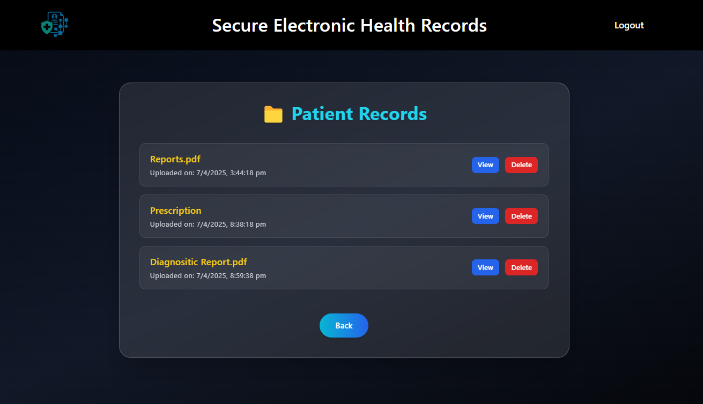
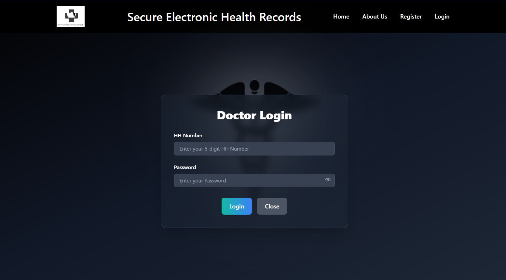
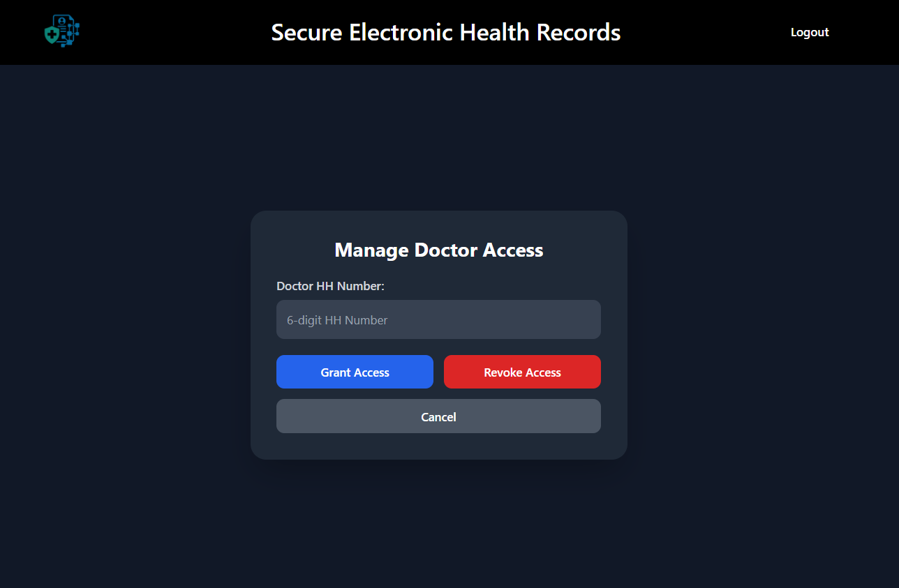

# 🏥 Decentralized Electronic Health Record (EHR) System

A secure and decentralized Electronic Health Record (EHR) system built using **Ethereum**, **IPFS**, **ReactJS**, and **MetaMask**. This platform empowers patients with control over their medical data, allowing them to manage access permissions securely through blockchain smart contracts.

## 📌 Features
- 🔐 Blockchain-based access control using Ethereum smart contracts
- 📁 Medical record storage with IPFS (InterPlanetary File System)
- 👨‍⚕️ Role-based dashboards (Patient, Doctor, Diagnostic Center)
- 💳 MetaMask integration for secure identity and transaction handling
- 📜 Transparent and immutable health data management

## 🛠️ Tech Stack
- **Frontend:** React.js, Tailwind CSS
- **Blockchain:** Solidity, Ethereum, Web3.js
- **Storage:** IPFS (via Pinata)
- **Wallet Integration:** MetaMask
- **Dev Tools:** Truffle, Ganache, Vercel

## 👥 User Roles
- **Patient:** Upload/view health records, grant/revoke access
- **Doctor:** View authorized records, manage patient access
- **Diagnostic Center:** Upload lab reports for patients

## 📷 Screenshots

### 🗂️ Patient Records View

### 🏠 Home Page

### 👨‍⚕️ Doctor Login

### 🔐 Access Control – Grant/Revoke Doctor Access

